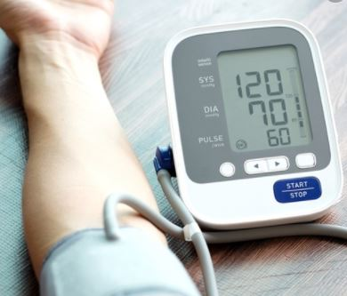
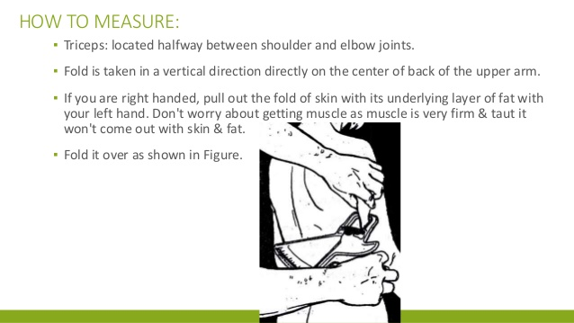
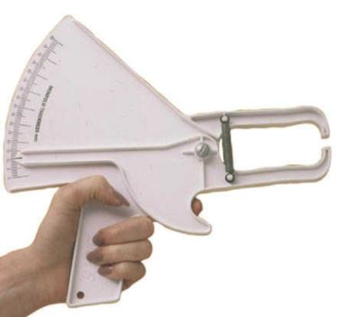
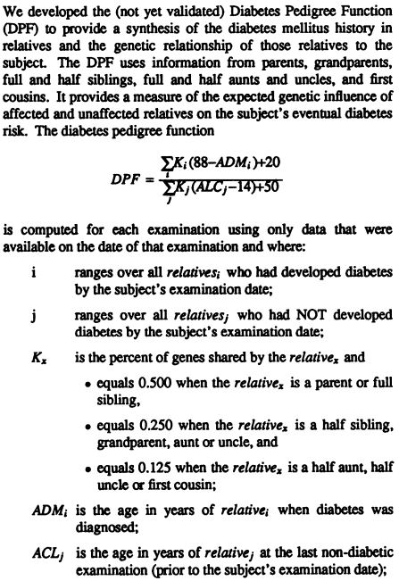
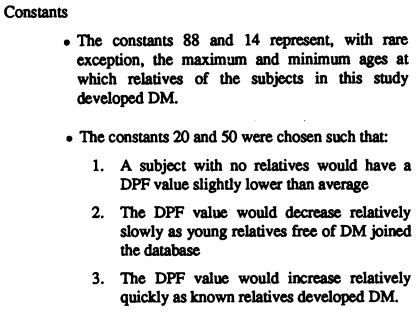
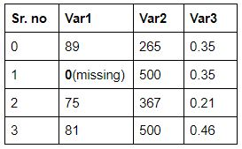
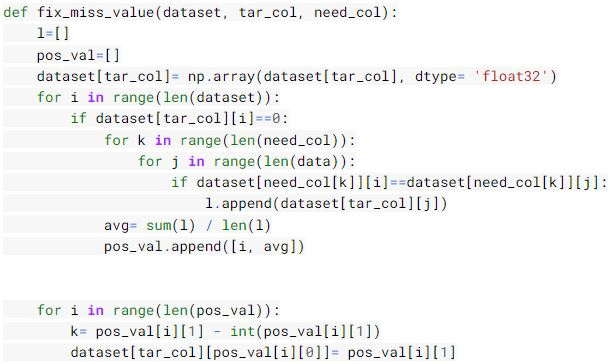

# FeCare
With an intention of **Fekar** (care in Hindi) towards the health of Indian women. 
[Web App link](https://fecare.herokuapp.com/) 
*To view demo scroll to the end*

Researchers have identified a bunch of districts in India that have a maximum prevalence of diabetes among women. At least 50 of the 640 districts studied have a high prevalence of diabetes — greater than one in every 10 among women.
And hence, FeCare classifier model aims to detect diabetes in Indian women. The clasifier was trained using [Pima Indians Diabetes Dataset](https://www.kaggle.com/uciml/pima-indians-diabetes-database)

## Dataset info:
The dataset consists of several medical predictor variables and one target variable, Outcome. Predictor variables include:
- Number of times pregnant
- Plasma glucose concentration, 2 hours in an oral glucose tolerance test (not included in training)
- Diastolic blood pressure (mm Hg)
- Triceps skinfold thickness (mm)
- 2-Hour serum insulin (mu U/ml) (not included in training)
- Body mass index
- Diabetes pedigree function
- Age (years)

As you can notice that two variables were not included in the training process, this was due to the reason that the Glucose Tolerance Test (GTG) can give very inaccurate results when conducted at home using a blood sugar measuring device. And same is the case for finding the reading of 2-Hour serum Insulin.

As this project aims to provide regular Diabetes check-up for all women(above the age of 20 years) irrespective of their work engagement(house-wives and working women), it is not possible in all cases that user will have the required tools, skills, and experience to execute the required test at home. And hence the above features were eliminated from the training process.

## Requirements:
- The user should know her general information(Age, Height, Weight, and Pregnancies)
- To know the reading of Diastolic Blood Pressure, the user should have a Blood Pressure monitor [like this](https://www.webmd.com/hypertension-high-blood-pressure/guide/hypertension-home-monitoring#1) which costs less than 100$

- To know the Tricep Skinfold Thickness value, the user should have a Skinfold Caliper and take the reading in the following manner:

The cost of Skinfold Caliper is less than 4$

- If the user do not know her Diabetes Pedigree Function, then it can be calculated on the web application using the following:

[Reference](https://www.ncbi.nlm.nih.gov/pmc/articles/PMC2245318/pdf/procascamc00018-0276.pdf) 

The user can input relative’s details(as much she knows) in the web-application, and Diabetes Pedigree Function will be calculated.

Note that the value of the DPF increases as the number of relatives who developed DM increases, as the age at which those relatives developed DM decreases, and as the percentage of genes that they share with the subject increases. Also notice that the value of the DPF decreases as the number of relatives who never developed DM increases, as their ages at their last examinain increase, and as the percent of genes that they share with the subject increases.

## Steps for pre-processing data and training classifier:
- The data has a very less number of 1s in Output(cases with positive diabetes), and hence this can affect the classifier’s accuracy to differentiate with 1s and 0s.

Due to this reason, almost equal amount of data for 1s and 0s were taken in the training set(for which the data was divided into two parts on the same basis and then segregated for training data)

- Now the two data frames(with 1s and 0s) were concatenated so that they can be accessed easily

- Fixing missing values(zeros in all other variables except ‘Pregnancies’):

***Missing values in  ‘Glucose’ =5  
  Missing values in  ‘BloodPressure’ =35  
  Missing values in  ‘SkinThickness’ =227  
  Missing values in  ‘Insulin’ =374  
  Missing values in  ‘BMI’ =11  
  Missing values in  ‘DiabetesPedigreeFunction’ =0  
  Missing values in  ‘Age’ =0*** 
  
  These values were fixed using the following algorithm: 
    Let’s say a data frame has 3 variables as shown below:
    
    

The missing value is **1st** value in **Var1**, now the **1st** values of **Var2** and **Var3** are noted, which are **500** and **0.35** respectively. Now we try to find similar values (500, 0.35) in **Var2** and **Var3**. Which in this case are **3rd** value in **Var2** and **0th** value in **Var3**. The missing value is then replaced by the average of **Var1** values at these positions(3rd and 0th). In this case: (89+81)/2 = 85= **Var1(1)** 

**Code:** 

The above algorithm is used to fix missing values in the following way:

- Glucose values from similar Age and Outcome values <code>(fix_miss_value(data, "Glucose", ["Age", "Outcome"])</code>
- BloodPressure values from similar Age and Glucose values
- BMI values from similar Age, BloodPressure and Glucose values
- SkinThickness values from similar Age, Outcome, Glucose, BMI values
The rest variables used in training(Age and DiabetesPedigreeFunction) had no missing values.

- Scaling us the DiabetesPedigreeFunction values: 
These values were less than ‘1’ while the other values were greater than 1. And hence these values were multiplied by ‘100’.

- Splitting data into Training and Testing set: 
  - For Training data, 300 entries with ‘0’ Outcome and 250 values with ‘1’ Outcome were taken. This collectively was 71% of the total data. Now the training data was ready.
  - The remaining 29% of data was further split into the 13% testing and 13% validation dataset. 

- Neural Network Definition(model_architecture.py): 
***Network( 
  (fc1): Linear(in_features=6, out_features=40, bias=True) 
  (fc2): Linear(in_features=40, out_features=81, bias=True) 
  (fc3): Linear(in_features=81, out_features=36, bias=True) 
  (fc4): Linear(in_features=36, out_features=19, bias=True) 
  (out): Linear(in_features=19, out_features=2, bias=True) 
)*** 
The training data was passed to the above Network and was trained for 1250 epochs. The best Trained Network which had the least validation loss was saved and was further used to made predictions on test data. The training accuracy given by the best model was 96.36% and the test accuracy was 85% (*FeCare.ipynb*) 
The pickle file('*FeCare.pkl*') of this best-trained model was saved and was further used to make predictions in the web-application. 

## Web-Application(app.py):
- General Instructions to user for providing required inputs.
- A “Know” button for user to know how she can measure the Tricep Skinfold Thickness
- Taking the required inputs(except Diabetes Pedigree Function)
- Information about what Diabetes Pedigree Function and how we can calculate that.
- Taking input of Diaetes Pedigree Function if user already knows, else taking inputs of the relatives information for calculating diabetes pedigree function
- A “Submit Info” button when the user is done inputting all the required information for calculating Diabetes Pedigree Function.
- And finally the “Results” button which will display weather the user has diabetes or not. If the user is found diabetic, the user is adviced to do Glucose - Tolerence Test(as next prefrence) at the nearest laboratory to confirm results.

 

### Demo(when Diabetes Pedigree Function is unknown)

 
 

### Demo(when Diabetes Pedigree Function is known)

